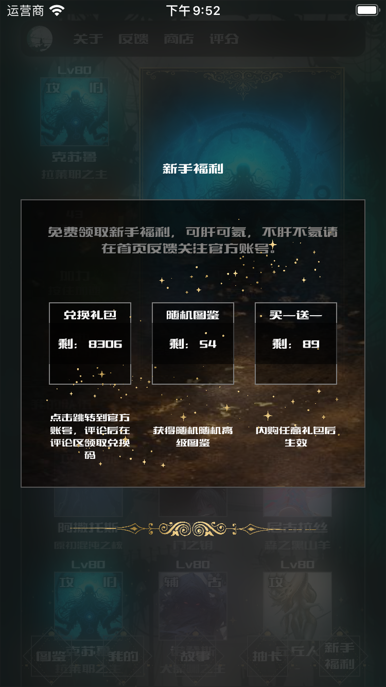

# KLSPicture

Contact: PP
Mail: 173695508@qq.com
Tel: 15795833509

 
达尔文的进化学说主张适者生存。凭著智慧，人类现在正可说是站在生物系谱的顶峰。一般大多数生物为了在严苛的环境中生存，都进化成便於存续繁衍的型态，而人类站在这个顶峰，身处於由自身所创造的、最适合人类属人类种生物生存的环境中，要生存，要繁衍，真是太轻易了。

是因为要繁衍太轻易了吗？

结果人类产生出爱情。

就另一种意义上来说，爱情这观念可谓妨碍了生物的繁殖。在大自然中若必须要情投意合才诞下下一代，恐怕有九成以上的物种都会消失。

那么，拥有爱情这种束缚的人类，所爱的对象，又是否必须是人类？只要灵魂是纯净的，外表是否没那么重要？

所谓的爱情，到底是出自精神上还是肉体上的？

在这个app中，主角所持的就是祖父托梦告知其存在的银之键，而靠著这把银之键，主角开启了第一之门、穷极之门，而到达了梦之国——克苏鲁世界。

